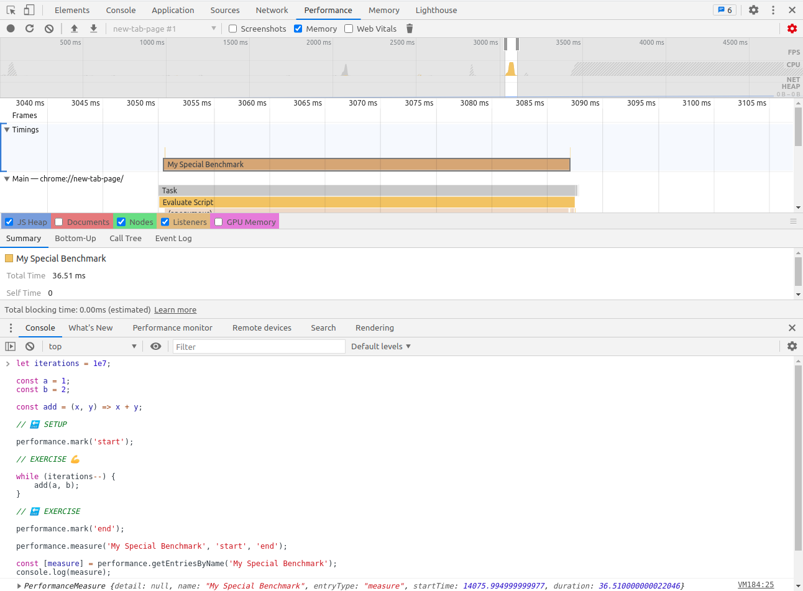
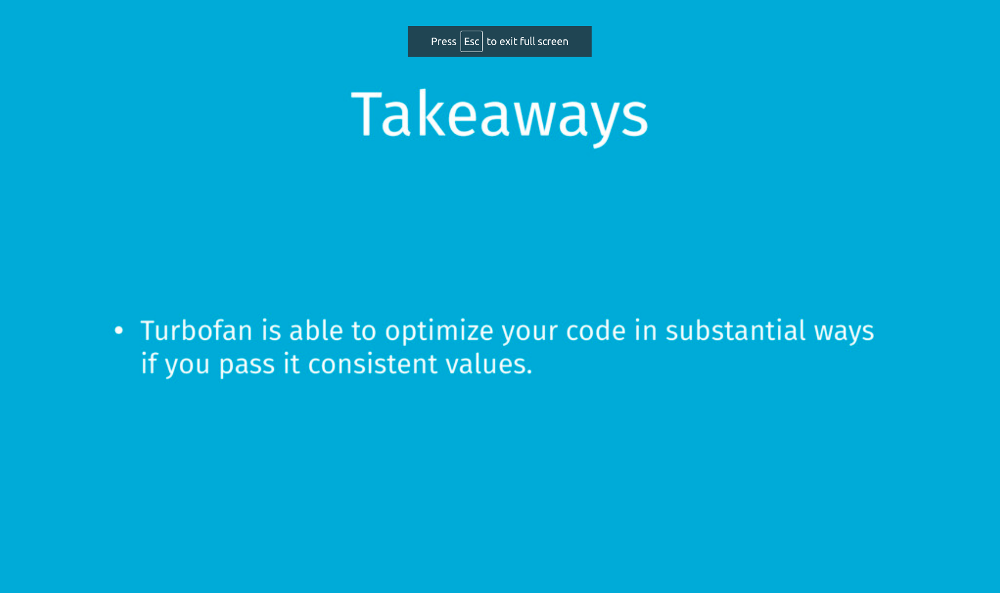
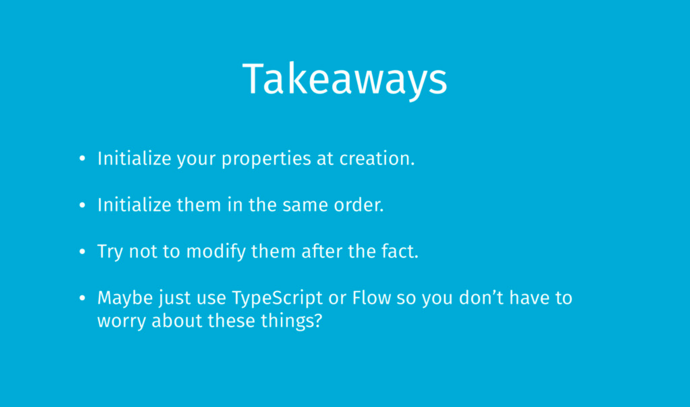
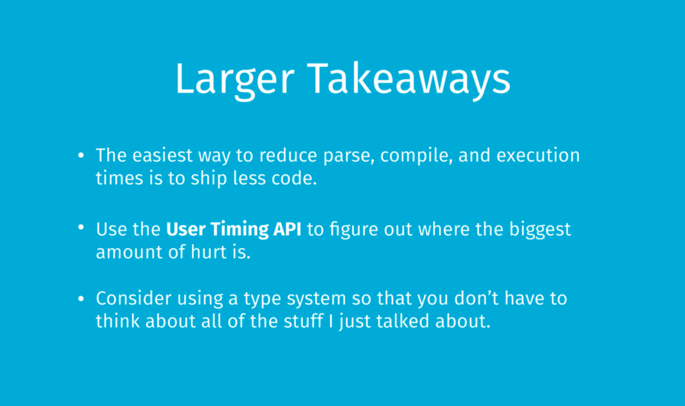

# JavaScript Performance

## The Optimizing Compiler

### code

Create a file `benchmark.js`

```js
const { performance, PerformanceObserver } = require('perf_hooks');

// 1e7 is 10000000. 7 stand for the amount of zeros you add in behind that number.
let iterations = 1e7;

const a = 1;
const b = 2;

const add = (x, y) => x + y;

performance.mark('start');

while (iterations--) {
	add(a, b);
}

performance.mark('end');

const obs = new PerformanceObserver((list, observer) => {
	console.log(list.getEntries()[0]);
	performance.clearMarks();
	observer.disconnect();
});
obs.observe({ entryTypes: ['measure'] });
performance.measure('My Special Benchmark', 'start', 'end');
```

<br />

Run in nodejs

```bash
$ node benchmark.js
PerformanceEntry {
  name: 'My Special Benchmark',
  entryType: 'measure',
  startTime: 36.352098,
  duration: 13.377464
}
```

<br />

V8 has bunch of flag to get more info. about what's going on. `--trace-opt` stand for trace optimization.

```bash
node --trace-opt benchmark
[marking 0x366cb8696ee1 <JSFunction (sfi = 0x2429e3fa2a69)> for optimized recompilation, reason: hot and stable]
[marking 0x366cb869fab9 <JSFunction add (sfi = 0x2429e3fa2b31)> for optimized recompilation, reason: small function]
[compiling method 0x366cb869fab9 <JSFunction add (sfi = 0x2429e3fa2b31)> (target OPTIMIZED_FUNCTION) using TurboFan]
[compiling method 0x366cb8696ee1 <JSFunction (sfi = 0x2429e3fa2a69)> (target OPTIMIZED_FUNCTION) using TurboFan OSR]
[optimizing 0x366cb8696ee1 <JSFunction (sfi = 0x2429e3fa2a69)> (target OPTIMIZED_FUNCTION) - took 0.355, 0.747, 0.034 ms]
[optimizing 0x366cb869fab9 <JSFunction add (sfi = 0x2429e3fa2b31)> (target OPTIMIZED_FUNCTION) - took 0.510, 0.641, 0.016 ms]
[completed optimizing 0x366cb869fab9 <JSFunction add (sfi = 0x2429e3fa2b31)> (target OPTIMIZED_FUNCTION)]
PerformanceEntry {
  name: 'My Special Benchmark',
  entryType: 'measure',
  startTime: 44.964923,
  duration: 14.903692
}
```

<br />

We optimized add for recompilation, we now went to TurboFan, it got optimized.

```bash
node --trace-opt benchmark.js | grep add
[marking 0x2dbe95f1f9e1 <JSFunction add (sfi = 0x118c445e28b1)> for optimized recompilation, reason: small function]
[compiling method 0x2dbe95f1f9e1 <JSFunction add (sfi = 0x118c445e28b1)> (target OPTIMIZED_FUNCTION) using TurboFan]
[optimizing 0x2dbe95f1f9e1 <JSFunction add (sfi = 0x118c445e28b1)> (target OPTIMIZED_FUNCTION) - took 0.362, 0.702, 0.011 ms]
[completed optimizing 0x2dbe95f1f9e1 <JSFunction add (sfi = 0x118c445e28b1)> (target OPTIMIZED_FUNCTION)]
```

<br />

_Get benchmark performance for Browser in performance tab._


## asdfasdf

`--allow-natives-syntax benchmark.js` V8 flag to use debugging.
`%NeverOptimizeFunction(add);` this line is never optimize the add function. optimization is use full.

```js
performance.mark('start');

// EXERCISE 💪

// V8 flag to use debugging
%NeverOptimizeFunction(add);

while (iterations--) {
	add(a, b);
}

// 🔚 EXERCISE

performance.mark('end');
```

```bash
node --allow-natives-syntax benchmark.js
PerformanceEntry {
  name: 'My Special Benchmark',
  entryType: 'measure',
  startTime: 40.825651,
  duration: 174.339942
}
```

----

<br />

`%OptimizeFunctionOnNextCall(add);` first time call.

```js
function add(x, y) {
	return x + y;
}

add(1, 2);
%OptimizeFunctionOnNextCall(add);
add(3, 4);
```

We can see it was optimized. we only run it once. Like a function usually is not optimized the first time it is run, because going to the optimization compiler it is not free.

```bash
$ node --allow-natives-syntax --trace-opt add.js
[manually marking 0x07f46f057971 <JSFunction add (sfi = 0x33331a2a2669)> for non-concurrent optimization]
[compiling method 0x07f46f057971 <JSFunction add (sfi = 0x33331a2a2669)> (target OPTIMIZED_FUNCTION) using TurboFan]
[optimizing 0x07f46f057971 <JSFunction add (sfi = 0x33331a2a2669)> (target OPTIMIZED_FUNCTION) - took 0.494, 0.384, 0.041 ms]
```

<br />

`%OptimizeFunctionOnNextCall(add);` after some changes

```js
function add(x, y) {
	return x + y;
}

add(1, 2);
%OptimizeFunctionOnNextCall(add);
add(3, '4');
```


```bash
$ node --allow-natives-syntax --trace-opt --trace-deopt add.js
[manually marking 0x1cfc18e97979 <JSFunction add (sfi = 0x3759873b8379)> for non-concurrent optimization]
[compiling method 0x1cfc18e97979 <JSFunction add (sfi = 0x3759873b8379)> (target OPTIMIZED_FUNCTION) using TurboFan]
[optimizing 0x1cfc18e97979 <JSFunction add (sfi = 0x3759873b8379)> (target OPTIMIZED_FUNCTION) - took 0.489, 0.395, 0.020 ms]
[bailout (kind: deopt-soft): begin 0x1cfc18e97979 <JSFunction add (sfi = 0x3759873b8379)> (opt #0) @0, FP to SP delta: 24, caller sp: 0x7ffdd8e6f070]
            ;;; deoptimize at </home/aman/frontend/Course--JavaScript-Performance/JavaScript-Performance/Deoptimization_and_Deleting_Properties/add.js:2:14>, Insufficient type feedback for binary operation
  reading input frame add => bytecode_offset=2, args=3, height=0, retval=0(#0); inputs:
      0: 0x1cfc18e97979 ;  [fp -  16]  0x1cfc18e97979 <JSFunction add (sfi = 0x3759873b8379)>
      1: 0x27cf85601141 ;  [fp +  32]  0x27cf85601141 <JSGlobal Object>
      2: 0x000300000000 ;  [fp +  24]  3
      3: 0x3759873b81a1 ;  [fp +  16]  0x3759873b81a1 <String[1]: #4>
      4: 0x1a888e301119 ;  [fp -  24]  0x1a888e301119 <NativeContext[243]>
      5: 0x3759873b81a1 ;  [fp +  16]  0x3759873b81a1 <String[1]: #4>
  translating interpreted frame add => bytecode_offset=2, variable_frame_size=8, frame_size=80
    0x7ffdd8e6f068: [top +  72] <- 0x27cf85601141 <JSGlobal Object> ;  stack parameter (input #1)
    0x7ffdd8e6f060: [top +  64] <- 0x000300000000 <Smi 3> ;  stack parameter (input #2)
    0x7ffdd8e6f058: [top +  56] <- 0x3759873b81a1 <String[1]: #4> ;  stack parameter (input #3)
    -------------------------
    0x7ffdd8e6f050: [top +  48] <- 0x000001461582 ;  caller's pc
    0x7ffdd8e6f048: [top +  40] <- 0x7ffdd8e6f0b0 ;  caller's fp
    0x7ffdd8e6f040: [top +  32] <- 0x1a888e301119 <NativeContext[243]> ;  context (input #4)
    0x7ffdd8e6f038: [top +  24] <- 0x1cfc18e97979 <JSFunction add (sfi = 0x3759873b8379)> ;  function (input #0)
    0x7ffdd8e6f030: [top +  16] <- 0x3759873b8cd1 <BytecodeArray[6]> ;  bytecode array
    0x7ffdd8e6f028: [top +   8] <- 0x003700000000 <Smi 55> ;  bytecode offset
    -------------------------
    0x7ffdd8e6f020: [top +   0] <- 0x3759873b81a1 <String[1]: #4> ;  accumulator (input #5)
[bailout (kind: deopt-soft): end 0x1cfc18e97979 <JSFunction add (sfi = 0x3759873b8379)> @0 => node=2, pc=0x000001461b80 (unsigned), caller sp=0x7ffdd8e6f070, took 0.349 ms]
```
You can see that we deoptimize that function just after one time calling it with some different argument.


----

## Deleting, Feeding Objects Solution

```js
class Point {
    constructor(x, y) {
        this.x = x;
        this.y = y;
        this.z = z;
    }
}

performance.mark('start');

while (iterations--) {
    const point = new Point(2, 4);
    JSON.stringify(point);
}

performance.mark('end');
```

```node
$ node benchmark_2.js 
PerformanceEntry {
  name: 'My Special Benchmark',
  entryType: 'measure',
  startTime: 36.877172,
  duration: 317.35414
}
```
<br />
When modifying this code what result will sow me.

```js
while (iterations--) {
    const point = new Point(2, 4);
    point.x = undefined
    JSON.stringify(point);
}
```

```bash
$ node benchmark_2.js 
PerformanceEntry {
  name: 'My Special Benchmark',
  entryType: 'measure',
  startTime: 34.996041,
  duration: 280.643985
}
```

<br />
again modify this code.

```js
while (iterations--) {
    const point = new Point(2, 4);
    delete point.z;
    JSON.stringify(point);
}
```

```bash
$ node benchmark_2.js 
PerformanceEntry {
  name: 'My Special Benchmark',
  entryType: 'measure',
  startTime: 35.784615,
  duration: 308.368296
}
```


<br />
again modify this code.

```js
while (iterations--) {
    const point = new Point(2, 4);
    delete point.x;
    JSON.stringify(point);
}
```

```bash
$ node benchmark_2.js 
PerformanceEntry {
  name: 'My Special Benchmark',
  entryType: 'measure',
  startTime: 34.168135,
  duration: 1126.144672
}
```
**It's take a long time.**
seems to me that if we delete the last one, we're okay. if we delete first or second ones. we all of sudden have gotten a lot slower


----

Code run with same objects;

```js
const objects = [{ a: 1 }, { a: 2 }, { a: 3 }, { a: 4 }];

performance.mark('start');

while (iterations--) {
    let sum = 0;
    const obj = objects[iterations & 3]
    sum = sum + obj.a;
}
```

```bash
$ node benchmark_3.js 
PerformanceEntry {
  name: 'My Special Benchmark',
  entryType: 'measure',
  startTime: 31.839572,
  duration: 21.36267
}
```

<br />

Code run with different objects


```js
const objects = [
    { a: 1 },
    { a: 2, b: 5, c: 20 },
    { c: 3, a: 3 },
    { b: 5, a: 4, c: 80 }
];

performance.mark('start');

while (iterations--) {
    let sum = 0;
    const obj = objects[iterations & 3]
    sum = sum + obj.a;
}
```

```bash
$ node benchmark_3.js 
PerformanceEntry {
  name: 'My Special Benchmark',
  entryType: 'measure',
  startTime: 36.672592,
  duration: 26.201831
}
```

## Monomorphism, Polymorphism, and Megamorphism


----

## Optimizing Objects

```js
const a = { a: 1 }
const b = { b: 1 }

console.log(% HaveSameMap(a, b));
```

```bash
$ node --allow-natives-syntax classes.js 
false
```

<br />

```js
const a = { a: 1 }
const b = { a: 1 }

console.log(% HaveSameMap(a, b));
```

```bash
$ node --allow-natives-syntax classes.js 
true
```

<br />

```js
const a = { a: 1 }
const b = { a: 5 }

console.log(% HaveSameMap(a, b));
```

```bash
$ node --allow-natives-syntax classes.js 
true
```

<br />

```js
const a = { a: 1 }
const b = { a: 50000000000 }

console.log(% HaveSameMap(a, b));
```

```bash
$ node --allow-natives-syntax classes.js 
false
```
which is, after you pass a 32 bit integer, it's not a small number.


<br />

```js
const a = { a: 1, b: 20 }
const b = { a: 5 }

console.log(% HaveSameMap(a, b));
```

```bash
$ node --allow-natives-syntax classes.js 
false
```

So it seems like V8 has in some way that it's keeping track of this.


<br />

```js
const a = { a: 1, b: 20 }
const b = { a: 5, b: 10 }

console.log(% HaveSameMap(a, b));
```

```bash
$ node --allow-natives-syntax classes.js 
true
```


<br />

```js
const a = { a: 1, b: 20 }
const b = { a: 5 }

b.b = 10;

console.log(% HaveSameMap(a, b));
```

```bash
$ node --allow-natives-syntax classes.js 
false
```

<br />

```js
const a = { a: 1 }
const b = { a: 5 }

a.b = 20;
b.b = 10;

console.log(% HaveSameMap(a, b));
```

```bash
$ node --allow-natives-syntax classes.js 
true
```
So they start the same the same, they start different and end up the same they are not the same.


<br />

```js
const a = { a: 1 }
const b = Object.assign({}, a)

console.log(% HaveSameMap(a, b));
```

```bash
$ node --allow-natives-syntax classes.js 
false
```

<br />

```js
const a = { a: 1 }
const b = Object.assign({}, a)
const c = Object.assign({}, a)

console.log(% HaveSameMap(b, c));
```

```bash
$ node --allow-natives-syntax classes.js 
false
```
Because, b and c is created in the same way.


<br />

```js
class Point {
    constructor(x, y) {
        this.x = x;
        this.y = y;
    }
}

const a = new Point(1, 2);
const b = new Point(3, 4);

console.log(% HaveSameMap(a, b));
```

```bash
node --allow-natives-syntax classes.js 
true
```


<br />

```js
const makeAPoint = () => {
    class Point {
        constructor(x, y) {
            this.x = x;
            this.y = y;
        }
    }

    return new Point(1, 2);
}

const a = makeAPoint();
const b = makeAPoint();

console.log(% HaveSameMap(a, b));
```

```bash
$ node --allow-natives-syntax classes_2.js false
```

So it looks like objects that either start the same or go through the same process of being made and not be the same. Even if they end up the same they went through a different path. Like V8 doesn't seem to believe they are the same object.


## Hidden Classes

When an object has never been created, we've never seen that property before, where it both works for the speculative optimization as well as these hidden classes.


## Scoping and Prototypes

```js
let iterations = 100000;
const test = () => {
    const add = point => point.x + point.y;
    class Point {
        constructor(x, y) {
            this.x = x;
            this.y = y;
        }
    }
    const point = new Point(10, 20);
    add(point);
}

performance.mark('start');

while (iterations--) {
    test();
}

performance.mark('end');
```

```bash
$ node benchmark.js 
PerformanceEntry {
  name: 'My Special Benchmark',
  entryType: 'measure',
  startTime: 30.289766,
  duration: 763.60027
}
```

<br />

Class move to the outer scope
```js
let iterations = 100000;

class Point {
    constructor(x, y) {
        this.x = x;
        this.y = y;
    }
}

const test = () => {
    const add = point => point.x + point.y;

    const point = new Point(10, 20);
    add(point);
}

performance.mark('start');

while (iterations--) {
    test();
}

performance.mark('end');
```

```bash
$ node benchmark.js 
PerformanceEntry {
  name: 'My Special Benchmark',
  entryType: 'measure',
  startTime: 30.929972,
  duration: 6.384692
}
```

I am creating class every run. I don't think that's what got me from 6 milliseconds to 763.





## Function Inlining

```js
let iterations = 1e7;

const square = (x) => x * x;
const sumOfSquare = (a, b) => square(a) + square(b);

performance.mark('start');

while (iterations--) {
    sumOfSquare(iterations, iterations + 1);
}

performance.mark('end');
```

```bash
$ node benchmark.js 
PerformanceEntry {
  name: 'My Special Benchmark',
  entryType: 'measure',
  startTime: 31.931626,
  duration: 13.630492
}
```


**Function inlining**
```bash
$ node --trace-turbo-inlining benchmark.js 
Considering 0x6319140 {0x15d8d5ba2911 <SharedFunctionInfo square>} for inlining with 0x6319450 {0x15d8d5baf009 <FeedbackVector[1]>}
Inlining small function(s) at call site #28:JSCall
Inlining 0x6319140 {0x15d8d5ba2911 <SharedFunctionInfo square>} into 0x62ee3f0 {0x15d8d5ba2961 <SharedFunctionInfo sumOfSquare>}
Considering 0x6319140 {0x15d8d5ba2911 <SharedFunctionInfo square>} for inlining with 0x6319450 {0x15d8d5baf009 <FeedbackVector[1]>}
Inlining small function(s) at call site #42:JSCall
Inlining 0x6319140 {0x15d8d5ba2911 <SharedFunctionInfo square>} into 0x62ee3f0 {0x15d8d5ba2961 <SharedFunctionInfo sumOfSquare>}
Considering 0x62f3ee8 {0x15d8d5ba2961 <SharedFunctionInfo sumOfSquare>} for inlining with 0x62f3ef8 {0x15d8d5baefb1 <FeedbackVector[5]>}
1 candidate(s) for inlining:
- candidate: JSCall node #51 with frequency 20341, 1 target(s):
  - target: 0x62f3ee8 {0x15d8d5ba2961 <SharedFunctionInfo sumOfSquare>}, bytecode size: 26, existing opt code's inlined bytecode size: 12
Inlining 0x62f3ee8 {0x15d8d5ba2961 <SharedFunctionInfo sumOfSquare>} into 0x6319e68 {0x15d8d5ba2849 <SharedFunctionInfo>}
Considering 0x62f50c8 {0x15d8d5ba2911 <SharedFunctionInfo square>} for inlining with 0x62f50d8 {0x15d8d5baf009 <FeedbackVector[1]>}
Inlining small function(s) at call site #92:JSCall
Inlining 0x62f50c8 {0x15d8d5ba2911 <SharedFunctionInfo square>} into 0x6319e68 {0x15d8d5ba2849 <SharedFunctionInfo>}
Considering 0x62f50c8 {0x15d8d5ba2911 <SharedFunctionInfo square>} for inlining with 0x62f50d8 {0x15d8d5baf009 <FeedbackVector[1]>}
Inlining small function(s) at call site #106:JSCall
Inlining 0x62f50c8 {0x15d8d5ba2911 <SharedFunctionInfo square>} into 0x6319e68 {0x15d8d5ba2849 <SharedFunctionInfo>}
PerformanceEntry {
  name: 'My Special Benchmark',
  entryType: 'measure',
  startTime: 41.722539,
  duration: 18.722956
}
```

I have to keep calling the function.
What if I just rewrote what we had the first time to what we had the second time?
sees you're calling the same function over and over and over again, , it'll basically go and rewrite your code so you're not calling that function.

## JavaScript Performance Takeaways


